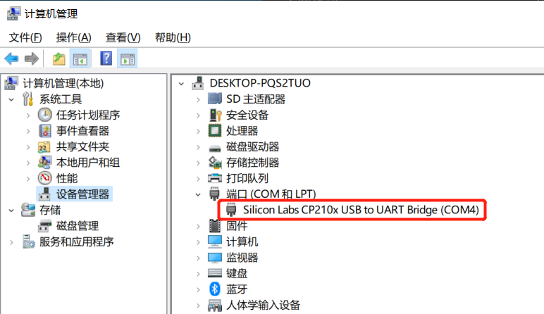
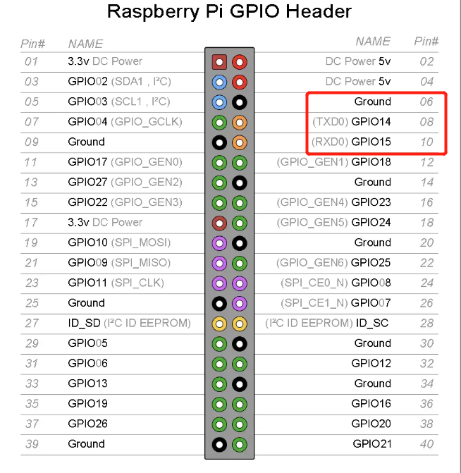
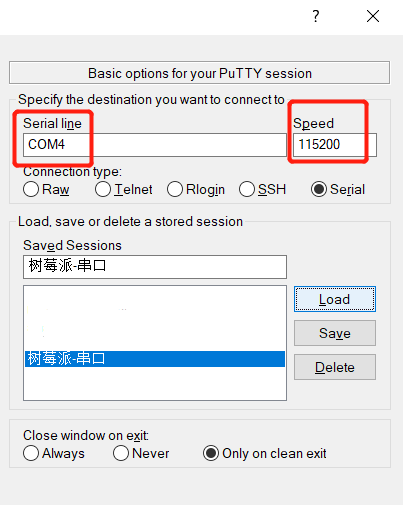
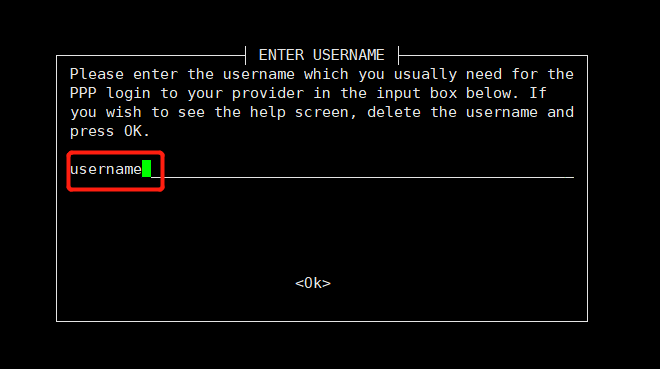

# 从零到路由器

## 配置介绍

硬件：cp2102（win10连接树莓派串口，有其他ttl接线亦可）、树莓派3b+

Raspbian-Buster-desktop-2020-02-13

## 概要

本次实验，无显示器，需要串口接入。

有手机分享热点，拨号软件会从这里下载。

拨号成功后，操作为设置dhcp（分配IP）、hostap（建立热点）、设置iptables转发

## 串口接入

### 安装cp2102的驱动

将cp2102 USB 插到电脑上，右键`此电脑`，打开`管理`



选择如上图所示设备，右键，选择`更新驱动程序` -> `自动搜索驱动程序`。等待驱动安装结束

### 设置树莓派串口输出

树莓派中共有2个串口。

一个是硬件串口（/dev/ttyAMA0）单独外设。

一个是mini串口（/dev/ttyS0），和cpu的时钟绑定。内核若降低主频，则波特率受到牵连。

默认是mini串口给GPIO，硬件串口给蓝牙。mini串口由于直接和cpu相关，不稳定，需要修改映射，所以做如下操作。

将烧录了系统的sd卡插到电脑上，修改/boot/config.txt

在最后一行加上如下文字

``` txt
dtoverlay=pi3-miniuart-bt
```

树莓派的sd卡共有两分区，该文件位于win10可以打开的分区。

注意，另外一个分区不要格式化

### 连接串口线

树莓派的GPIO如下图。



我们需要的是红框圈出来那三个点。

Ground接cp2102的Ground。

TXD0接cp2102的RXD

RXD0接cp2102的TXD

### 进入shell

打开putty，如下图所示设置。



接上电源，待系统启动后，按回车。

默认的用户名是pi，密码是raspberry

## 接入互联网

### 连接手机热点

``` bash
sudo su  # 进入特权模式
raspi-config  # 打开设置
```

选择 `Network Options` -> `Wi-fi`

输入手机热点的SSID，再输入密码，即可。

### 修改网卡优先级（非必要）

此时你可以尝试 `ping baidu.com` ，若通，则直接下一步，否则，需要设置默认路由。

原因是我的树莓派插了网线，获取了IP。网线的网卡优先级比WiFi网卡的优先级高，所以数据走了网线。而网线未拨号，导致了这个问题。

可以拔网线解决，也可以修改优先级解决。

``` bash
ip route show  # 显示路由
route del default gw 192.168.1.1  # 此为网线网卡的网关，而不是获取的IP
```

### pppoe上网

``` bash
apt install pppoe pppoeconf pppstatus  # 安装软件
pppoeconf  # 开始拨号。一路yes，直到输入用户名和密码。请注意，输入的时候，把username这个英文删掉
```



继续yes，直到建立连接成功。

此时可能又ping不通了。因为刷新了路由表，需要手动配置网关。

``` bash
route add default gw 10.1.1.14  # 此时是pppoe拨号获取的ip，别搞错了。
```

## 配置DHCP

``` bash
apt install 
```

编辑配置文件：/etc/udhcpd.conf，修改如下四个参数：

``` txt
start           192.168.199.20  #default: 192.168.0.20
end             192.168.199.200 #default: 192.168.0.254

interface       wlan0           #default: eth0

opt     router  192.168.199.1
```

编辑配置文件：/etc/default/udhcpd，将 `DHCPD_ENABLED="no"` 注释掉

``` bash
# DHCPD_ENABLED="no"
```

编辑配置文件：/etc/network/interfaces，在末尾处，加上如下参数

``` txt
allow-hotplug wlan0
iface wlan0 inet static
address 192.168.199.1
netmask 255.255.255.0
```

## 配置dnsmasq

``` bash
apt install dnsmasq
```

编辑配置文件：/etc/dnsmasq.conf，在开始处，加上如下参数
``` txt
interface=wlan0
listen-address=192.168.199.1
bind-interfaces
server=8.8.8.8
domain-needed
bogus-priv
dhcp-range=192.168.199.20,192.168.199.200,12h
```

## 设置iptables转发

编辑配置文件：/etc/sysctl.conf，在开始处，加上如下参数，允许转发

``` txt
net.ipv4.ip_forward=1
```

编辑开机启动文件：/etc/rc.local，在`exit 0 ` 语句之前，加入如下语句。以便开机自动设置转发规则。

``` txt
iptables -t nat -A POSTROUTING -o ppp0 -j MASQUERADE
iptables -A FORWARD -i ppp0 -o wlan0 -m state --state RELATED,ESTABLISHED -j ACCEPT
iptables -A FORWARD -i wlan0 -o ppp0 -j ACCEPT
```


不想本次重启，可以执行如下命令

``` bash
echo 1 > /proc/sys/net/ipv4/ip_forward  # 直接解除转发限制，立即生效

# 直接设置转发规则。
iptables -t nat -A POSTROUTING -o ppp0 -j MASQUERADE
iptables -A FORWARD -i ppp0 -o wlan0 -m state --state RELATED,ESTABLISHED -j ACCEPT
iptables -A FORWARD -i wlan0 -o ppp0 -j ACCEPT
```

## 配置hostapd

``` bash
apt install hostapd
```

修改配置文件：/etc/default/hostapd，加入如下参数，让hostapd知道配置文件在哪。

``` txt
DAEMON_CONF="/etc/hostapd/hostapd.conf"
```

热点配置文件参考：https://wiki.gentoo.org/wiki/Hostapd

编写一个配置文件：/etc/hostapd/hostapd.conf，文件内容可参考如下：

``` txt
# 简单的2.4G配置文件
interface=wlan0

driver=nl80211

ssid=test_24G

hw_mode=g

channel=11

macaddr_acl=0

auth_algs=1

ignore_broadcast_ssid=0

wpa=2

wpa_passphrase=passWord

wpa_key_mgmt=WPA-PSK

#wpa_pairwise=TKIP

rsn_pairwise=CCMP
```

``` txt
# 简单的5G配置文件
interface=wlan0

ssid=test_5G

hw_mode=a

channel=149

ieee80211d=1
country_code=CN
ieee80211n=1
ieee80211ac=1
wmm_enabled=1

auth_algs=1

wpa=2

wpa_passphrase=passWord

wpa_key_mgmt=WPA-PSK

rsn_pairwise=CCMP
```

变动service配置文件，以便开机启动和管理。

``` bash
rm /etc/systemd/system/hostapd.service  # 删除原有service连接文件,该文件指向null
systemctl daemon-reload  # 加载正确的配置文件
```

## 配置完毕，重启！