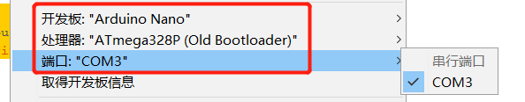
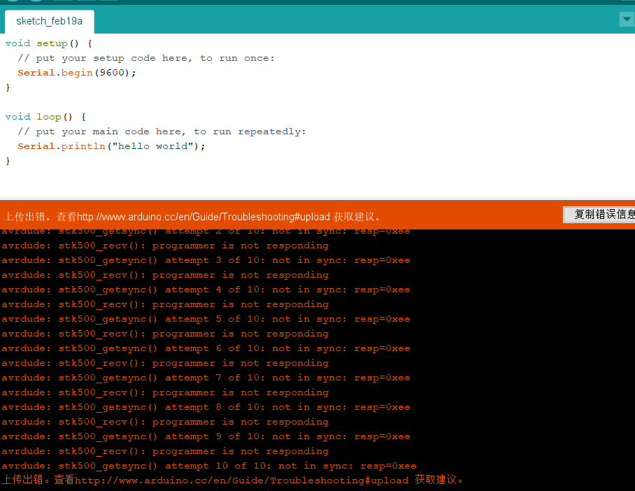
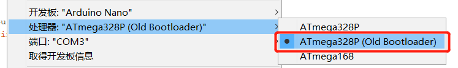
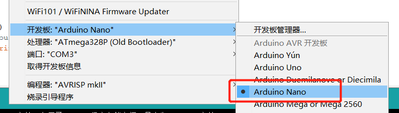

# 入门


## 硬件参数

型号：arduino nano

USB芯片型号：CH340G

接口：mini usb

## 准备工作

下载arduino IDE：https://downloads.arduino.cc/arduino-nightly-windows.zip

下载USB驱动（需要针对个人arduino去下载相应的驱动，本连接是下载CH340G驱动）：http://www.wch.cn/downloads/CH341SER_ZIP.html

## 步骤

### 安装IDE软件、驱动软件

### 连接arduino nano 

用USB连接线，连接nona。一头为mini usb ，另一头为USB A

如图，打开 计算机 -> 管理 -> 设备管理器


记住COM3，待会会用到它

### 编写程序

打开arduino IDE，默认生成代码如下：

``` c
void setup() {
  // put your setup code here, to run once:
}

void loop() {
  // put your main code here, to run repeatedly:
}
```

当nano启动时候，会执行一次setup()，然后重复执行loop()。

入门的目标是，编写“hello would”。

所以，程序修改如下

``` c
void setup() {
  // put your setup code here, to run once:
  
  // 设置串口波特率
  Serial.begin(9600);
}

void loop() {
  // put your main code here, to run repeatedly:

  // 重复在串口打印字符串
  Serial.println("hello world");
}
```

进行3个基本设置。开发板的型号、处理器的型号和端口。

其中，处理器的型号尤要注意。如果是改版的nano，应当选择Old Bootloader，否则会编译成功，上传失败。



### 运行程序

程序左上角，有“验证”和“上传”两个按钮。点验证后，编译成功，即可点上传。

### 检验程序运行

在arduino IDE中，打开 “工具” -> “串口监视器”

可以看到，“hello world”不停刷屏。此表示，程序上传成功。

## 排错

1. avrdude: stk500_recv(): programmer is not responding
   

   

   原因：Arduino AVR Boards 增加了对新电路板的支持。对旧的不兼容。所以，在选择处理器的时候，必须要选择Old Bootloader。

   

   

