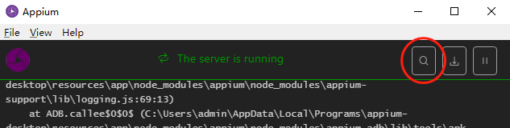
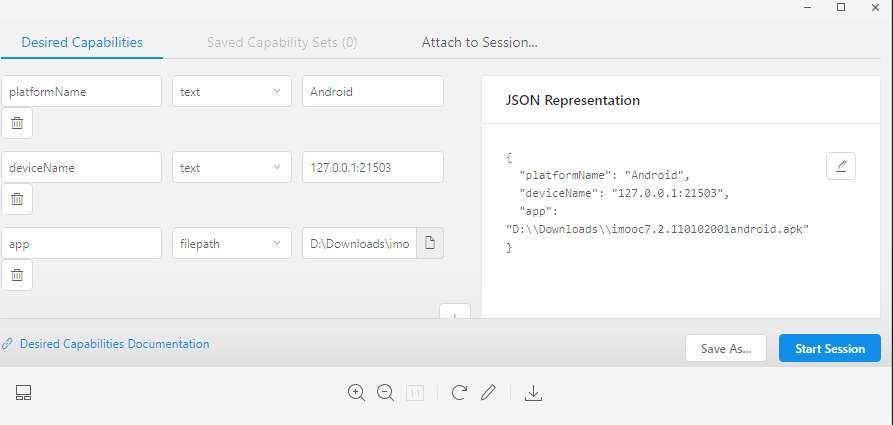

# 初步使用

## 启动appium

启动桌面程序后，直接按start，进入下图



点击上图的“搜索按钮”，打开下图窗口



如图配置。

其中，`deviceName` 可以用 `ADB工具` 获得。具体操作为，打开小黑窗，输入 `adb devices` ，即可获得已连接的设备编号。一般来说，电脑上的模拟器会是 `127.0.0.1:23222` 之类，真机则是一串字符串

`app` 则是apk的安装包路径。点击 `Start Session` 后，真机/模拟器 会安装相关的2个软件和把apk给安装上去。

上图对应的json文件

``` json
{
  "platformName": "Android",
  "deviceName": "FI7TGAYTIBBUVSV8",
  "app": "D:\\Downloads\\imooc7.2.110102001android.apk"
}
```

## 常见工具使用

### adb

``` sh
adb devices  # 显示当前电脑连接的设备
```

### uiautomatorviewer

双击打开，点击左上角，链接设备，可以看到当前设备的界面

### appt

``` sh
aapt dump badging appFilePath  # 像是在反向解析安装包
```

会解析页面，寻找页面名称，key为 `launchable-activity` 后边的name是目标启动页面的名称。若该页面没找到，将会报错。